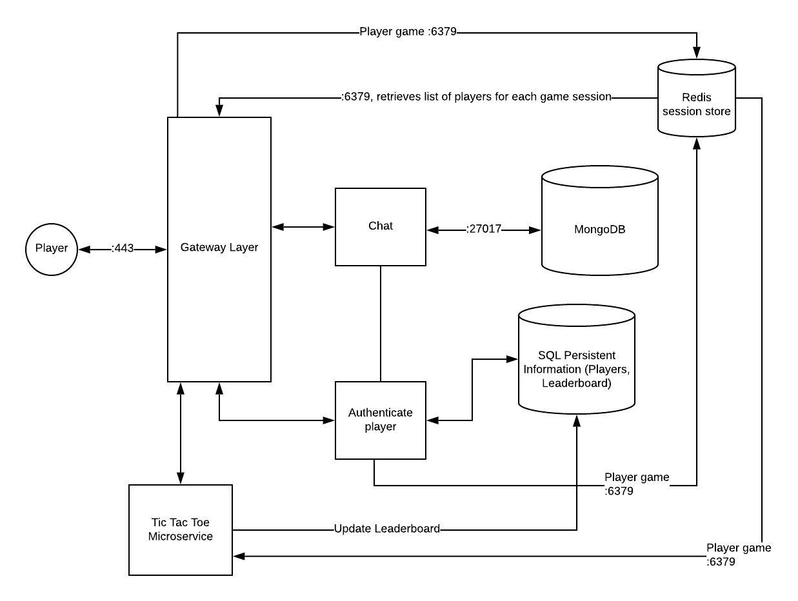

# Project: Quarantine Game-Zone

Group Members: Jill, Vivian, Rafael, & Amit

## Hosted Project
- [Quarantine-Gamezone](https://rafibayer.me)
- [API](https://api.rafibayer.me)

## Project description
Quarantine Game-Zone is an application that allows you to play games with others online via a web browser. Players will be able to select a game from a game lobby and add their friend(s) to play!

Our target audience is anyone looking for a way to stay social by playing games, especially during quarantine. There are many other similar services, such as Jackbox, Drawful, and more, but we want to offer a free and easy-to-use alternative. As developers, we want to create an app that we could see ourselves using. As students experiencing this unprecedented online quarter, we think it’s more important than ever to stay connected, and games are a fantastic way to do that.

## Endpoints
### Games lobby
- /v1/games/
    - GET; Admin purposes, see all currently running games
        - 200: Gets all games sessions that are currently happening, returns map of:
            - lobbyID: gameType
        - 500: Internal server error
- /v1/games/tictactoe 
    - POST
        - 201 created: Creates a game state on the server, sends you the initial state of the game as JSON
        - 500: Internal server error
- /v1/games/tictactoe/{lobby id}
    - GET
        - 200 ok: Returns the current state of the game
        - 401 unauthorized: Could not verify player, or they are not in the game
        - 404 not found: The game wasn’t found
        - 415: Unsupported media type
        - 500: Internal server error
    - POST
        - 201 created: Applies the move to the game, returns the updated game state as JSON
        - 400 bad request: An illegal move is given
        - 401 unauthorized: Could not verify player, or they are not in the game 
        - 404 not found: The game wasn’t found
        - 415: Unsupported media type
        - 500: Internal server error
### Players
- /v1/players
    - POST
        - 201 created: Create a new player
- Specific player
- /v1/players/{player id OR me}
    - PATCH
        - 200 ok:  update player (first name, last name)
        - 403 forbidden: not authenticated to make changes to this player profile
        - 404 not found: player not found
        - 415: Unsupported media type
    - GET
        - 200 ok: get player info
        - 403 forbidden: not authenticated to get player profile
        - 404 not found: player not found
        - 415: Unsupported media type
    - DELETE
        - 200 ok:
        - 403 forbidden: not authenticated to delete this player
        - 404 not found: player not found
        - 415: Unsupported media type
### Sessions
- /v1/sessions
    - POST
        - 201 created: Created a new session
        - 401 unauthorized: Bad credentials
        - 415: unsupported media type
        - 500: Internal server error
- Specific session
- /v1/sessions/{session id or mine}
    - DELETE
        - 403 forbidden: not mine
        - 200 ok: Ends session

## Models
### Gateway & Lobbies
```
# Stores a users session and chosen nickname
sessionState: {  
	starTime: time.Time
    nickname: string
} 

# Used by client to create new lobby
newGameLobby: {
    game_type: string
}

# internal representation of a gamelobby
gamelobby: {
    lobby_id: string
    game_type: string
    players: [sessionID]
    capacity: int
    gameID: gameSessionID
}

# game lobby representation for client
gamelobby: {
    lobby_id:   string
    game_type:  string
    players:    [string]
    capacity:   int
    game_ready: boolean
}
```
### Tic-Tac-Toe
```

# Tic tac toe internal gamestate
TicTacToe: {
	board:   [[int]] 
	xturn:   bool     
	xid:     string   
	oid:     string   
	xname:   string   
	oname:   string   
	outcome: string   
}

# Tic tac toe move from a client
Move: {
    row: int
    col: int
}

# Tic tac toe response to client
TicTacToeResponse: {
	board:   [[int]] 
	xturn:   bool     
	xname:   string   
	oname:   string   
	outcome: string   
}
```
### Trivia
```
# Trivia Question
questionType: {
    question:       string
    answers:        [string]
    correctAnswer:  string # internal only
}

# Player
playerType: {
    sessID:          string # internal only
    nickname:        string
    score:           int
    alreadyAnswered: bool
}

# Internal Gamestate
gameStateSchema : {
    players:      [playerType]
    counter:      int
    questionBank: [questionType]
}

# Response Gamestate for client
gameStateResponse : {
    players:         [playerType]
    questionNumer:   int
    activeQuestion:  questionType
}

# Move from client
move: {
    move: int
}
```

## Use cases and priority:  

| Priority | User        | Description                               |
|----------|-------------|-------------------------------------------|
| P0       | As a player | I want to be able to create a nickname    |
| P0       | As a player | I want to be able to make a new game      |
| P0       | As a player | I want to be able to join a game          |
| P0       | As a player | I want to be able to see games I can join |
| P0       | As a player | I want to be able to play a game          |
| P1       | As a player | I want to exit a game lobby               |
| P1       | As a player | I want to exit a game after completion    |
| P1       | As a player | I want to see the result of the game      |
| P1       | As a player | I want to select different types of games |
| P2       | As a player | I want to chat with players in the lobby  |


## Original Infrastructure diagram


## Current Infrastructure diagram


